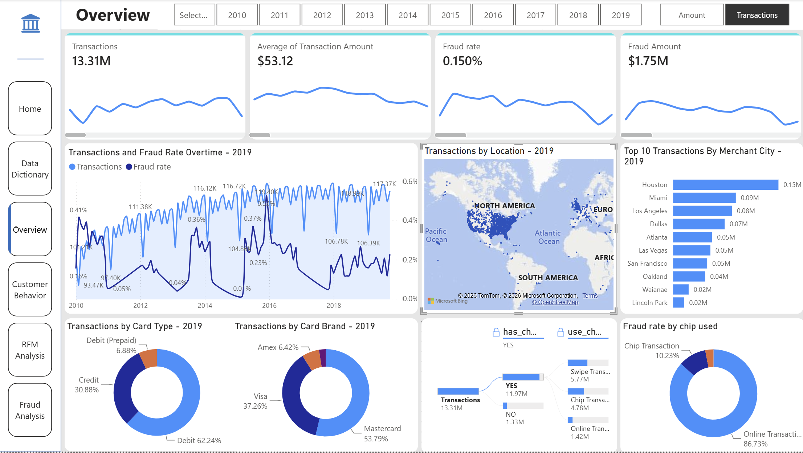
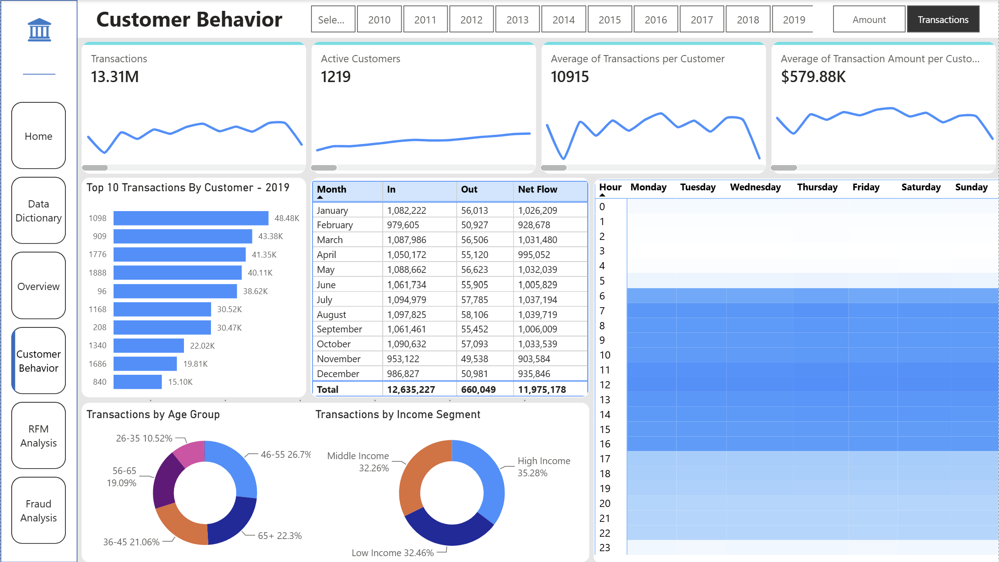
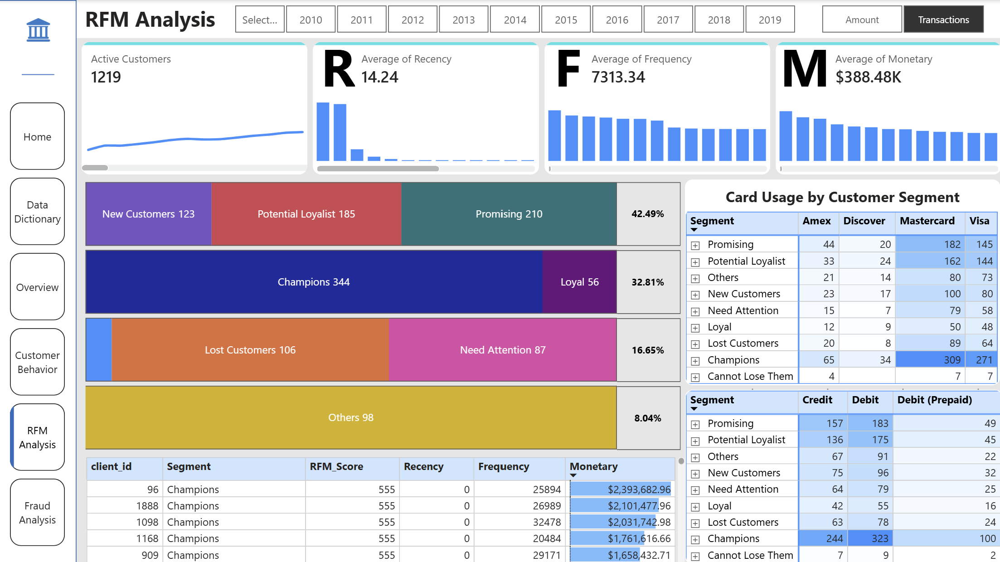
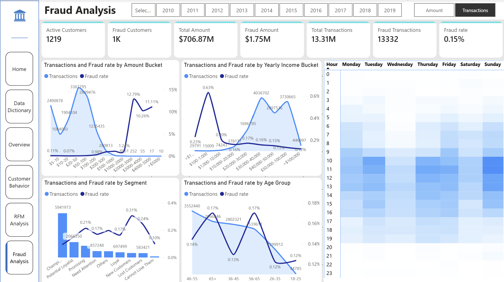

# 🏦 Fraud Detection in Banking Transactions

**Notebook:** `banking_transaction_analytics.ipynb`  
**Dashboard:** `banking_transaction_dashboard.pbix`  
**Author:** Nguyễn Thị Ngọc Minh    
**Project Type:** Power BI + PySpark ML  

---

## 📊 Project Overview

Fraud detection is a critical challenge in the financial industry, where traditional rule-based systems struggle to capture complex fraud patterns in massive transaction volumes.

This project leverages **supervised machine learning** to build and evaluate fraud detection models using PySpark ML on a large-scale banking dataset with labeled fraud cases.

**Dataset Source:** [Kaggle - Financial Transactions Dataset](https://www.kaggle.com/datasets/computingvictor/transactions-fraud-datasets)

### 🎯 Objectives

The objective is to analyze transactional data to:

* Identify abnormal transaction patterns and suspicious financial behavior
* Understand customer transaction behavior, spending patterns, and customer segmentation.
* Analyze the most frequently used products and services in transactions.
* Detect transaction anomalies and fraud risks using machine learning models
* Generate actionable business insights for banking operations and risk management

## 📂 Dataset Information

* **Total Transactions:** 13,305,928
* **Customers:** 2,000 unique clients
* **Cards:** 6,146 card records
* **Fraud Rate:** ~0.15% (highly imbalanced)
* **Time Period:** 2010s decade

### 🔑 Key Tables & Features

#### **1. Transactions Data** (13.3M records)

| Column         | Description                                      |
| -------------- | ------------------------------------------------ |
| id             | Unique transaction identifier                    |
| date           | Transaction timestamp                            |
| client_id      | Customer identifier                              |
| card_id        | Card identifier                                  |
| amount         | Transaction amount (USD)                         |
| use_chip       | Whether chip authentication was used             |
| merchant_id    | Merchant identifier                              |
| merchant_city  | Merchant location (city)                         |
| merchant_state | Merchant location (state)                        |
| zip            | Merchant ZIP code                                |
| mcc            | Merchant Category Code (business type)           |
| errors         | Transaction error indicators                     |

#### **2. Users Data** (2,000 customers)

| Column              | Description                    |
| ------------------- | ------------------------------ |
| client_id           | Customer identifier            |
| current_age         | Customer age                   |
| retirement_age      | Expected retirement age        |
| birth_year          | Year of birth                  |
| gender              | Customer gender                |
| latitude, longitude | Customer location              |
| per_capita_income   | Income per capita              |
| yearly_income       | Annual income                  |
| total_debt          | Total outstanding debt         |
| credit_score        | Credit score                   |
| num_credit_cards    | Number of credit cards owned   |

#### **3. Cards Data** (6,146 cards)

| Column               | Description                           |
| -------------------- | ------------------------------------- |
| id                   | Card identifier                       |
| client_id            | Owner customer identifier             |
| card_brand           | Card brand (Visa, Mastercard, etc.)   |
| card_type            | Card type (Credit, Debit)             |
| has_chip             | Whether card has chip technology      |
| credit_limit         | Card credit limit                     |
| acct_open_date       | Account opening date                  |
| year_pin_last_changed| Last PIN change year                  |
| card_on_dark_web     | Whether card info leaked on dark web  |

#### **4. Fraud Labels** (supervised targets)

| Column   | Description                               |
| -------- | ----------------------------------------- |
| id       | Transaction identifier                    |
| is_Fraud | Fraud label (True/False, ~0.15% positive) |

---

## ⚙️ Methodology

### **1. Data Preprocessing**

* **Data Cleaning:** Handled missing values, removed duplicates, and corrected data types across all tables.
* **Data Integration:** Merged the transactions, users, cards, and fraud labels tables into a unified dataset.
* **Feature Engineering:** Created transaction flow type from transaction amounts and added temporal features including card expiry date, hour, weekday, weekend indicator, month, and year.

### **2. Exploratory Data Analysis (EDA)**

* Categorical and Numerical feature distributions analysis
* Fraud Rate Analysis by time, card information, transaction amount, and income
* Customer segment analysis (RFM)
* Product Performance Analysis by Transaction Amount and Count
* Correlation analysis and feature relationships

### **3. Model Training & Evaluation**

* **Train-Test Split:** 80:20 ratio
* **Models Evaluated:**
  * Logistic Regression
  * Random Forest
  * GBTClassifier 
* **Evaluation Metrics:**
  * AUC (Area Under ROC Curve)
  * PR AUC (Precision-Recall AUC)
  * Accuracy, Precision, Recall, F1-Score
  * Confusion Matrix analysis

---

## 📈 Model Performance Comparison

### 🏆 Overall Results

| Model                   | AUC        | PR AUC     | Accuracy | Precision | Recall   | F1-Score |
| ----------------------- | ---------- | ---------- | -------- | --------- | -------- | -------- |
| **Logistic Regression** | 0.8444     | 0.0213     | 99.85%   | 28.97%    | 0.29%    | 0.58%    |
| **Random Forest**       | 0.8934     | 0.0927     | 99.85%   | **98.91%**| 2.56%    | 5.00%    |
| **GBTClassifier**       | **0.9427** | **0.2748** | **99.87%**| 94.54%    | **11.42%**| **20.38%**|

### 🔍 Fraud Detection Performance

| Model                   | Fraud Caught (TP) | Fraud Missed (FN) | False Alarms (FP) | Total Fraud |
| ----------------------- | ----------------- | ----------------- | ----------------- | ----------- |
| **Logistic Regression** | 31                | 10,581            | 76                | 10,612      |
| **Random Forest**       | 272               | 10,340            | **3**             | 10,612      |
| **GBTClassifier**       | **1,212**         | **9,400**         | 70                | 10,612      |

---

## 💡 Key Insights

### ✅ Model Strengths

**GBTClassifier (Recommended Model)**
* **Highest discriminative ability:** AUC 0.9427 indicates excellent ranking of fraud vs. legitimate transactions
* **Best fraud detection:** Catches **1,212 out of 10,612 fraud cases** (11.42% recall)
* **Highest PR AUC (0.2748):** Nearly **3× better** than Random Forest and **13× better** than Logistic Regression on imbalanced data
* **High precision (94.54%):** 94 out of 100 flagged transactions are actually fraudulent
* **Very low false positive rate (0.00098%):** Only 70 false alarms out of 7.1M legitimate transactions
* **Captures complex patterns:** Sequential tree-building effectively learns non-linear fraud behaviors

**Random Forest**
* **Highest precision (98.91%):** Nearly perfect when flagging fraud
* **Lowest false positives (3):** Minimal customer disruption
* **Stable performance:** Ensemble approach reduces overfitting

**Logistic Regression**
* **Fast and interpretable:** Provides feature coefficients for business interpretation
* **Good baseline:** AUC 0.8444 demonstrates reasonable ranking ability
* **Regulatory compliance:** Model transparency supports explainability requirements

### ⚠️ Critical Limitations

* **All models exhibit low fraud recall** under default thresholds due to extreme class imbalance (~0.15% fraud)
* **Logistic Regression fails to detect fraud effectively:** Only 0.29% recall makes it unsuitable for production
* **Even best model (GBT) misses ~88% of fraud cases** without threshold optimization
* **Accuracy is misleading:** 99.85% accuracy simply reflects the imbalanced class distribution

### 🎯 Trade-off Analysis

```
                      Fraud Detection       False Alarms     Overall Quality
Logistic Regression:      ★☆☆☆☆            ★★☆☆☆           ★★☆☆☆ (Weak Baseline)
Random Forest:            ★★☆☆☆            ★★★★★           ★★★☆☆ (Highest Precision)
GBTClassifier:            ★★★★☆            ★★★★☆           ★★★★★ (Best Overall)
```

---

## 📊 Power BI Dashboard

The Power BI dashboard provides an interactive view of transaction activity, customer behavior, RFM segmentation, and fraud patterns across the U.S. banking transaction dataset from 2010–2019.

---

### **Dashboard 1 — Overview**



#### **Transaction & Market**

* Transaction activity increased steadily from **2010 to 2016**, then remained relatively stable through 2019.
* Transaction activity shows **seasonal fluctuations**, with a noticeable decline around February and alternating increases and decreases throughout the remaining months.
* Transactions are mainly concentrated in the **Eastern and coastal regions of the U.S.**

#### **Product & Payment**

* **Debit cards** account for the largest share of transaction volume and value, followed by credit and prepaid cards.
* **Mastercard** has the highest transaction usage, followed by Visa, Amex, and Discover.
* Approximately **11.97M of 13.31M transactions (~90%)** were made using chip-enabled cards.
* From 2015 onward, **chip transactions became the dominant payment method**, replacing swipe transactions as the most frequently used channel.

#### **Fraud Patterns by Payment Channel**

* **Online transactions account for approximately 86.73% of fraud cases**, followed by chip transactions at 10.23% and swipe transactions.
* Chip transactions became the dominant payment method after 2015 and initially showed relatively lower fraud exposure.
* However, fraud patterns within chip transactions changed over subsequent years, highlighting the need for **continuous monitoring rather than assuming a payment method remains consistently low-risk**.

#### **Key Takeaway**

The dataset represents a predominantly **retail-oriented customer base**, with debit cards and small-value transactions accounting for most activity. **Chip payments became increasingly dominant after 2015**, reflecting a shift toward modern payment methods. However, **online transactions account for the majority of fraud cases (86.73%)**, making online payments a key area for fraud monitoring. The changing fraud patterns across payment channels also highlight the importance of **continuously monitoring payment security risks over time**.

---

### **Dashboard 2 — Customer Behavior**



* **Inflow transactions account for approximately 95% of transaction value**, indicating a strong concentration of incoming transaction activity.
* Customers aged **46+ account for nearly half of transaction activity**, while the 26–35 age group represents the smallest share among available age groups.
* No transaction records are available for customers under 26 in the dataset.
* Transaction activity is concentrated between **06:00 and 16:00**, gradually declining during the evening and remaining relatively low between 00:00 and 05:00.

#### **Key Takeaway** 

The customer base is predominantly **middle-aged and older**, with transaction activity concentrated during daytime hours and a strong concentration of incoming transaction value.

---

### **Dashboard 3 — RFM Analysis**



RFM analysis evaluates customers across three dimensions:

* **Recency:** How recently the customer made a transaction.
* **Frequency:** How frequently the customer makes transactions.
* **Monetary:** The total transaction value generated by the customer.

Each dimension is scored from **1 to 5**, with 5 representing stronger customer engagement or value.

Customers are grouped into three main categories:

* **VIP Customers:** Champions, Loyal
* **New Customers:** New Customers, Potential Loyalists, Promising
* **At-Risk Customers:** Need Attention, Cannot Lose Them, Lost Customers

The dashboard visualizes **customer distribution and transaction activity across segments**, helping identify high-value, newly acquired, and at-risk customer groups.

It also provides **customer-level RFM scores** to support deeper analysis of individual customer behavior and value.

#### **Key Takeaway**

RFM segmentation provides a behavioral view of the customer base, helping identify **high-value customers, new customers, and customers at risk of churn**. These insights can support **customer retention, re-engagement strategies, and prioritization of high-value customer groups**.


---

### **Dashboard 4 — Fraud Analysis**



* Fraud rate increases as **transaction amount increases**, particularly for transactions above **$500**, despite their relatively low transaction volume.
* Customers with annual income between **$100–$1,000** show the highest fraud rate among income groups, while also accounting for relatively few transactions.
* **New Customers** have the highest fraud rate among RFM segments at approximately **0.31%**, while Champions show a lower fraud rate of around **0.10%**.
* Customers aged **56+** have a fraud rate of approximately **0.17%** and represent nearly half of transaction activity.
* Fraud is concentrated during the main transaction period of **06:00–16:00** and is relatively higher on **Sunday**.
* Transactions above approximately **$1,000** represent an important high-risk area for additional monitoring.

#### **Key Takeaway**

Fraud risk is associated with specific **transaction amounts, customer segments, payment channels, and transaction periods**. High-value transactions, online payments, new customers, and selected time periods should therefore receive greater attention in fraud monitoring and prevention strategies.


---

## 🚀 Business Recommendations

### **1. Strengthen Risk-Based Transaction Monitoring**

* **Apply stricter verification for high-value transactions**, particularly transactions above **$500–$1,000**, where fraud rates are relatively higher.
* **Strengthen monitoring of online transactions**, which account for **86.73% of identified fraud cases**, through stronger authentication and transaction-level risk assessment.
* **Increase monitoring during high-risk periods**, particularly **06:00–16:00 and weekends, especially Sunday**.
* Develop **risk-based transaction rules** combining transaction amount, payment channel, time, customer profile, and historical behavior rather than relying on a single fraud indicator.

### **2. Strengthen New Customer & Account Monitoring**

* **Enhance KYC and identity verification for new customers**, including personal information and biometric verification where applicable.
* **Monitor newly opened accounts after activation** to identify unusual transaction patterns or activity inconsistent with the customer's expected behavior.
* Pay additional attention to **low-income customers ($100–$1,000 annual income)** when transaction values or transaction behavior appear inconsistent with their historical profile.
* Incorporate **RFM segments into fraud monitoring** to identify customers requiring additional review while avoiding unnecessary controls for consistently low-risk customers.

### **3. Improve Fraud Detection Models**

* **Optimize classification thresholds** using the Precision-Recall curve rather than relying solely on the default 0.5 threshold.
* Apply **cost-sensitive learning** to place greater emphasis on missed fraud cases.
* Explore **advanced imbalance-handling techniques**, such as SMOTE, ADASYN, or other resampling approaches.
* Expand behavioral features, including **transaction velocity, spending deviation, and sequential transaction patterns**.
* Perform **hyperparameter optimization and cross-validation** to improve model generalization.
* Implement **SHAP or other explainability techniques** to identify the factors contributing to fraud predictions.

### **4. Expected Business Impact**

* **Reduce fraud exposure** by focusing monitoring resources on high-risk transactions, channels, time periods, and customer segments.
* **Improve early identification of suspicious activity**, particularly for online and high-value transactions and newly opened accounts.
* **Prioritize fraud investigations** using customer behavior and model-based risk scores.
* **Reduce unnecessary customer friction** by applying additional verification selectively to higher-risk activities.
* Establish a stronger foundation for **continuous fraud monitoring and future model improvement**.

---

## 🛠️ Technical Stack

**Platform & Compute**

* **Databricks** (Serverless Spark)
* **Apache Spark 3.x** (distributed data processing)

**Programming & Libraries**

* **Python 3.x** (pandas, NumPy, scikit-learn)
* **PySpark ML** (Pipeline, VectorAssembler, StandardScaler, StringIndexer, OneHotEncoder)
* **ML Algorithms:** Logistic Regression, Random Forest, GBTClassifier
* **Evaluation:** BinaryClassificationEvaluator, confusion matrix, Precision, Recall, F1-Score
* **Visualization:** Matplotlib, Seaborn

**Data Source & Storage**

* **Kaggle:** [Financial Transactions Dataset](https://www.kaggle.com/datasets/computingvictor/transactions-fraud-datasets)
* **Google BigQuery:** Used to store and access the imported Kaggle dataset


---

## 📂 Project Structure

```
Banking-Transaction-Analysis/
│
├── README.md
├── banking_transaction_analytics.ipynb
├── banking_transaction_dashboard.pbix
│
└── Data Tables
    ├── transactions_data          # 13.3M transaction records
    ├── users_data                 # 2K customer profiles
    ├── cards_data                 # 6.1K card records
    └── train_fraud_labels         # Fraud labels (supervised targets)
```

---

## 🔮 Future Enhancements

### **1. Advanced Modeling**

* Explore **advanced ML, deep learning, and ensemble models** to capture more complex fraud patterns.
* Benchmark different approaches against **established fraud detection research**.

### **2. Feature Expansion**

* Add **transaction velocity, spending deviation, sequential behavior, merchant, location, and temporal features**.
* Identify additional predictive variables by reviewing **established fraud detection studies**.

### **3. Data Preparation & Imbalance Handling**

* Evaluate alternative **scaling and transformation methods** for highly skewed features.
* Explore **cost-sensitive learning, SMOTE, ADASYN, and other imbalance-handling techniques**.

### **4. Real-Time Fraud Monitoring**

* Develop a **real-time transaction monitoring system** with continuous fraud risk scoring.
* Generate **automated alerts** for high-risk transactions and support continuous customer behavior monitoring.

### **5. Explainable AI & Further Research**

* Apply **SHAP** to identify the most influential factors behind fraud predictions.
* Use these findings to develop **new behavioral features** and identify potential directions for further fraud-risk research.

---

## 👤 Author

**Nguyen Thi Ngoc Minh**  
**GitHub:** https://github.com/ngocminh0123

