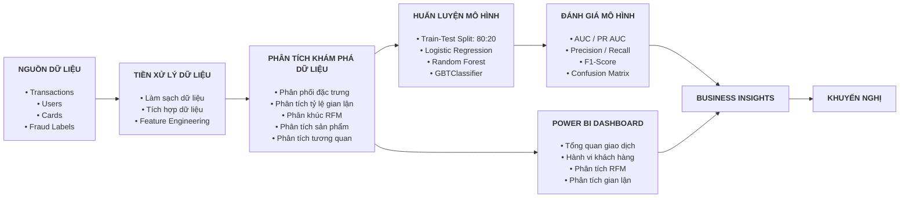
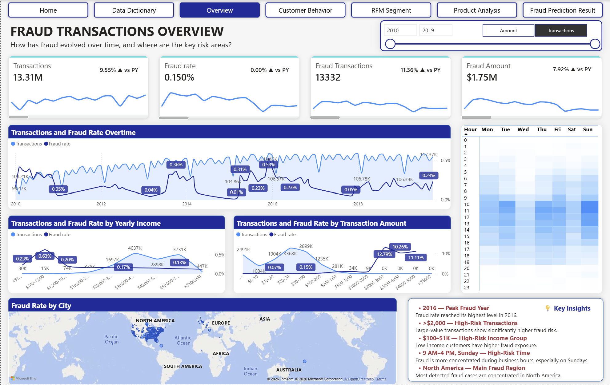
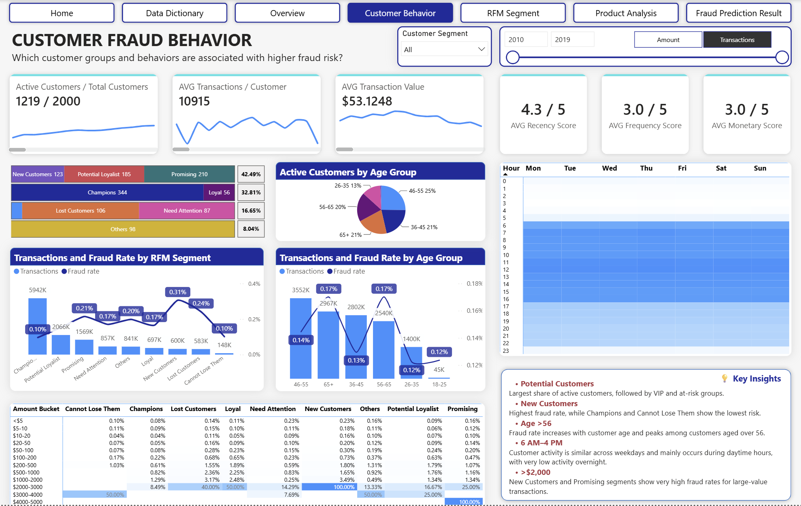
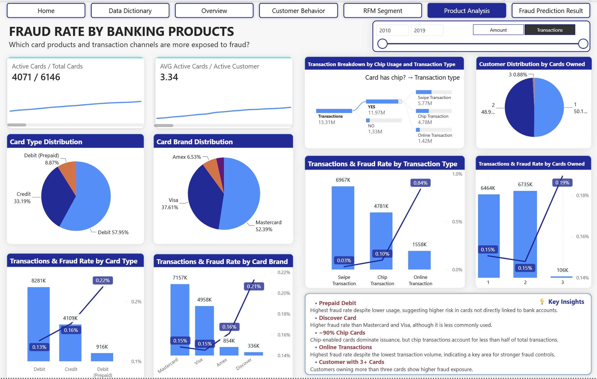
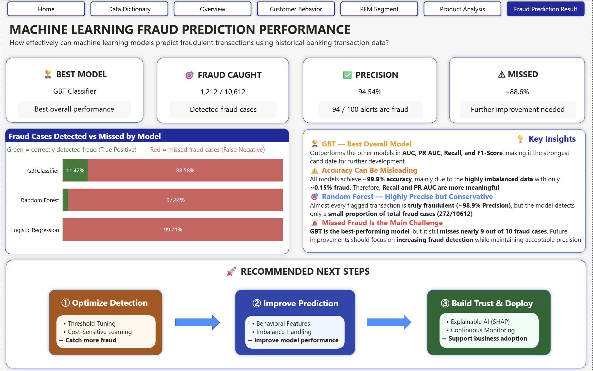

# Đánh giá rủi ro gian lận trong giao dịch ngân hàng

[English](README_en.md) | **Tiếng Việt**

---

## 1. Bối cảnh kinh doanh

Gian lận giao dịch là một trong những rủi ro trọng yếu đối với ngân hàng do có thể gây tổn thất tài chính, ảnh hưởng đến khách hàng, làm gia tăng chi phí xử lý và tạo ra rủi ro uy tín cũng như rủi ro tuân thủ. Khi quy mô và tốc độ giao dịch ngày càng lớn, phương pháp giám sát chỉ dựa trên các quy tắc cố định có thể không nhận diện đầy đủ những mẫu gian lận phức tạp hoặc thay đổi theo thời gian.

Trong bối cảnh đó, CRO giao cho Risk Analyst thực hiện dự án với bốn mục tiêu chính:

1. Đánh giá tổng thể thực trạng gian lận, đồng thời xác định các xu hướng và mẫu hình gian lận trọng yếu.
2. Xác định các nhóm khách hàng có rủi ro cao và phân tích gian lận theo từng phân khúc khách hàng.
3. Xác định các sản phẩm và kênh giao dịch có mức độ rủi ro gian lận cao.
4. Đánh giá các mô hình Machine Learning nhằm hỗ trợ dự báo và cải thiện khả năng phát hiện gian lận.

---

## 2. Các tệp chính trong dự án

| Tệp / thư mục | Nội dung |
| --- | --- |
| [`README.md`](README.md) | Báo cáo dự án bằng tiếng Việt và là trang giới thiệu mặc định trên GitHub. |
| [`README_en.md`](README_en.md) | Báo cáo dự án bằng tiếng Anh. |
| [`banking_transaction_analytics.ipynb`](banking_transaction_analytics.ipynb) | Notebook Python/PySpark thực hiện làm sạch dữ liệu, phân tích khám phá, kiểm định, feature engineering và xây dựng mô hình Machine Learning. |
| [`requirements.txt`](requirements.txt) | Danh sách thư viện Python cần thiết để chạy môi trường phân tích. |

---

## 3. Dữ liệu phân tích

### 3.1. Quy mô dữ liệu

| Chỉ tiêu | Quy mô |
| --- | ---: |
| Tổng số giao dịch ban đầu | 13,305,928 |
| Hồ sơ khách hàng | 2,000 |
| Hồ sơ thẻ | 6,146 |
| Giao dịch có nhãn được sử dụng trong tập phân tích mô hình | Khoảng 8.91 triệu |
| Tỷ lệ giao dịch gian lận | Khoảng 0.15% |
| Giai đoạn quan sát | 2010–2019 |

Tỷ lệ gian lận rất thấp so với tổng số giao dịch, cho thấy đây là bài toán phân loại mất cân bằng nghiêm trọng. Vì vậy, Accuracy không được sử dụng riêng lẻ để kết luận về chất lượng mô hình; các chỉ số PR-AUC, Precision, Recall và F1-score được xem xét đồng thời.

### 3.2. Các bảng dữ liệu và đặc trưng chính

#### 1. `transactions_data.csv` — Dữ liệu giao dịch (13.3 triệu bản ghi)

| Cột | Mô tả |
| --- | --- |
| `id` | Mã giao dịch |
| `date` | Thời gian giao dịch |
| `client_id` | Mã khách hàng |
| `card_id` | Mã thẻ |
| `amount` | Giá trị giao dịch (USD) |
| `use_chip` | Giao dịch có sử dụng xác thực bằng chip hay không |
| `merchant_id` | Mã đơn vị bán hàng |
| `merchant_city` | Địa điểm của đơn vị bán hàng (thành phố) |
| `merchant_state` | Địa điểm của đơn vị bán hàng (bang) |
| `zip` | Mã ZIP của đơn vị bán hàng |
| `mcc` | Merchant Category Code (loại hình kinh doanh) |
| `errors` | Thông tin lỗi giao dịch |

#### 2. `users_data.csv` — Dữ liệu khách hàng (2,000 khách hàng)

| Cột | Mô tả |
| --- | --- |
| `client_id` | Mã khách hàng |
| `current_age` | Tuổi khách hàng |
| `retirement_age` | Độ tuổi nghỉ hưu dự kiến |
| `birth_year` | Năm sinh |
| `gender` | Giới tính |
| `latitude`, `longitude` | Vị trí khách hàng |
| `per_capita_income` | Thu nhập bình quân đầu người |
| `yearly_income` | Thu nhập hàng năm |
| `total_debt` | Tổng dư nợ |
| `credit_score` | Điểm tín dụng |
| `num_credit_cards` | Số lượng thẻ tín dụng sở hữu |

#### 3. `cards_data.csv` — Dữ liệu thẻ (6,146 thẻ)

| Cột | Mô tả |
| --- | --- |
| `id` | Mã thẻ |
| `client_id` | Mã khách hàng |
| `card_brand` | Thương hiệu thẻ (Visa, Mastercard,...) |
| `card_type` | Loại thẻ (Credit, Debit) |
| `has_chip` | Thẻ có công nghệ chip hay không |
| `credit_limit` | Hạn mức tín dụng |
| `acct_open_date` | Ngày mở tài khoản |
| `year_pin_last_changed` | Năm thay đổi PIN gần nhất |
| `card_on_dark_web` | Thông tin thẻ có bị phát tán trên dark web hay không |

#### 4. `train_fraud_labels.csv` — Nhãn gian lận

| Cột | Mô tả |
| --- | --- |
| `id` | Mã giao dịch |
| `is_Fraud` | Nhãn gian lận (True/False, khoảng 0.15% positive) |

### 3.3. Nguồn dữ liệu

- **Nguồn công khai:** [Kaggle – Financial Transactions Dataset](https://www.kaggle.com/datasets/computingvictor/transactions-fraud-datasets)
- **Nền tảng xử lý:** Databricks và Apache Spark.
- **Phạm vi sử dụng:** Phân tích, minh họa phương pháp và phát triển mô hình thử nghiệm.

---

## 4. Quy trình thực hiện dự án

```mermaid
flowchart LR

A["<b>NGUỒN DỮ LIỆU</b>

• Transactions
• Users
• Cards
• Fraud Labels"]

B["<b>TIỀN XỬ LÝ DỮ LIỆU</b>

• Làm sạch dữ liệu
• Tích hợp dữ liệu
• Feature Engineering"]

C["<b>PHÂN TÍCH KHÁM PHÁ DỮ LIỆU</b>

• Phân phối đặc trưng
• Phân tích tỷ lệ gian lận
• Phân khúc RFM
• Phân tích sản phẩm
• Phân tích tương quan"]

D["<b>HUẤN LUYỆN MÔ HÌNH</b>

• Train-Test Split: 80:20
• Logistic Regression
• Random Forest
• GBTClassifier"]

E["<b>ĐÁNH GIÁ MÔ HÌNH</b>

• AUC / PR AUC
• Precision / Recall
• F1-Score
• Confusion Matrix"]

F["<b>POWER BI DASHBOARD</b>

• Tổng quan giao dịch
• Hành vi khách hàng
• Phân tích RFM
• Phân tích gian lận"]

G["<b>BUSINESS INSIGHTS</b>"]

H["<b>KHUYẾN NGHỊ</b>"]

A --> B --> C
C --> D --> E --> G
C --> F --> G
G --> H
```

### 4.1. Chuẩn bị và xử lý dữ liệu

- Kiểm tra cấu trúc, kiểu dữ liệu, giá trị thiếu và bản ghi trùng lặp.
- Chuẩn hóa giá trị giao dịch và các trường định dạng tiền tệ.
- Xử lý thông tin vị trí và lỗi giao dịch bị thiếu theo quy tắc của dự án.
- Kết hợp dữ liệu giao dịch với hồ sơ khách hàng, hồ sơ thẻ và nhãn gian lận.
- Xây dựng các biến về giờ, ngày, tháng, năm, nhóm tuổi, nhóm thu nhập, nhóm giá trị giao dịch và đặc điểm sản phẩm.

### 4.2. Phân tích thực trạng

Phân tích tập trung vào ba lớp thông tin:

1. **Quy mô hoạt động:** số lượng và giá trị giao dịch theo thời gian, khách hàng, sản phẩm và kênh.
2. **Mức độ rủi ro:** số lượng và tỷ lệ gian lận trong từng phân khúc.
3. **Ý nghĩa quản trị:** khu vực cần ưu tiên giám sát, tăng cường xác thực hoặc tiếp tục điều tra.

### 4.3. Phân khúc khách hàng RFM

Khách hàng được đánh giá trên ba tiêu chí:

- **Recency:** mức độ gần đây của giao dịch.
- **Frequency:** tần suất giao dịch.
- **Monetary:** tổng giá trị giao dịch.

Điểm RFM được sử dụng để phân nhóm khách hàng như Champions, Loyal, New Customers, Potential Loyalists, Need Attention, Cannot Lose Them và Lost Customers. Trong dự án này, RFM được sử dụng như một lớp phân khúc hành vi để hỗ trợ phân tích rủi ro, không thay thế hệ thống phân hạng rủi ro khách hàng của ngân hàng.

### 4.4. Xây dựng và đánh giá mô hình

Ba mô hình được lựa chọn để đại diện cho các mức độ phức tạp khác nhau:

- **Logistic Regression:** mô hình nền, dễ diễn giải.
- **Random Forest:** mô hình tập hợp cây, có khả năng mô hình hóa quan hệ phi tuyến.
- **GBTClassifier:** mô hình boosting, tối ưu tuần tự các cây quyết định để cải thiện khả năng phân loại.

Các mô hình được so sánh trên nhiều chỉ số để phản ánh đồng thời khả năng phân biệt, khả năng phát hiện gian lận và chi phí cảnh báo sai.

---

## 5. Kết quả phân tích thực trạng trên Power BI

Phần phân tích Power BI được trình bày theo ba dashboard chính, lần lượt đánh giá thực trạng gian lận tổng thể, rủi ro theo khách hàng và rủi ro theo sản phẩm hoặc kênh giao dịch.

### 5.1. Dashboard Overview — Thực trạng và khu vực rủi ro chính

Dashboard Overview ghi nhận **13.31 triệu giao dịch**, **13,332 giao dịch gian lận**, tỷ lệ gian lận **0.150%** và tổng giá trị gian lận khoảng **USD 1.75 triệu** trong giai đoạn 2010–2019.

Các phát hiện chính:

- Số lượng giao dịch có xu hướng tăng trong giai đoạn đầu và duy trì ở mức tương đối ổn định trong các năm sau đó; tỷ lệ gian lận biến động mạnh hơn và đạt mức cao nhất vào năm **2016**.
- Tỷ lệ gian lận tăng rõ rệt ở các giao dịch có giá trị lớn, đặc biệt từ **USD 2,000 trở lên**.
- Nhóm khách hàng có thu nhập khoảng **USD 100–1,000** ghi nhận mức độ rủi ro cao hơn các nhóm thu nhập còn lại trong dữ liệu quan sát.
- Gian lận tập trung nhiều trong khoảng **09:00–16:00**, đặc biệt vào Chủ nhật.
- Phần lớn các trường hợp gian lận được ghi nhận tại khu vực **Bắc Mỹ**.

**Đề xuất:** ngân hàng nên ưu tiên giám sát giao dịch giá trị cao và các khung thời gian có mức độ tập trung gian lận đáng chú ý. Các tín hiệu này cần được kết hợp với hồ sơ khách hàng, sản phẩm và kênh giao dịch thay vì sử dụng như điều kiện từ chối độc lập.

### 5.2. Dashboard Customer Behavior — Nhóm khách hàng cần ưu tiên giám sát

Dashboard Customer Behavior phân tích **1,219 khách hàng có hoạt động trên tổng số 2,000 khách hàng**, đồng thời đối chiếu quy mô giao dịch và tỷ lệ gian lận theo phân khúc RFM, nhóm tuổi, thời điểm và giá trị giao dịch.

Các phát hiện chính:

- Nhóm khách hàng tiềm năng chiếm **42.49%** số khách hàng hoạt động, tiếp theo là nhóm VIP với **32.81%**, nhóm có nguy cơ với **16.65%** và các nhóm còn lại với **8.04%**.
- **New Customers** có tỷ lệ gian lận cao nhất trong các phân khúc RFM, khoảng **0.31%**; Champions và Cannot Lose Them có tỷ lệ thấp nhất, khoảng **0.10%**.
- Nhóm khách hàng từ **56 tuổi trở lên** ghi nhận tỷ lệ gian lận khoảng **0.17%**, cao hơn một số nhóm tuổi còn lại.
- Hoạt động giao dịch chủ yếu diễn ra trong khoảng **06:00–16:00** và giảm xuống mức thấp vào ban đêm.
- Các phân khúc New Customers, Loyal, Lost Customers và Promising ghi nhận tỷ lệ gian lận cao ở nhóm giao dịch trên **USD 2,000**.

**Đề xuất:** khách hàng mới nên được tăng cường giám sát trong giai đoạn đầu của quan hệ khách hàng. Tuổi, thu nhập hoặc phân khúc RFM chỉ nên được sử dụng như tín hiệu bổ sung trong một cơ chế đánh giá đa yếu tố.

### 5.3. Dashboard Product Analysis — Sản phẩm và kênh giao dịch có rủi ro cao

Dashboard Product Analysis phân tích **4,071 thẻ hoạt động trên tổng số 6,146 thẻ** và mức độ rủi ro theo loại thẻ, thương hiệu thẻ, phương thức giao dịch và số lượng thẻ khách hàng sở hữu.

Các phát hiện chính:

- Thẻ Debit chiếm tỷ trọng lớn nhất trong danh mục, tiếp theo là Credit và Debit (Prepaid).
- Debit (Prepaid) có tỷ lệ gian lận cao nhất giữa các loại thẻ, khoảng **0.22%**.
- Mastercard là thương hiệu thẻ được sử dụng nhiều nhất, tiếp theo là Visa, Amex và Discover.
- Discover có tỷ lệ gian lận cao nhất giữa các thương hiệu thẻ, khoảng **0.21%**.
- Giao dịch Online có tỷ lệ gian lận **0.84%**, cao hơn giao dịch Chip (**0.10%**) và Swipe (**0.03%**), mặc dù có số lượng giao dịch thấp nhất trong ba phương thức.
- Khách hàng sở hữu ba thẻ có tỷ lệ gian lận khoảng **0.19%**, cao hơn nhóm sở hữu một hoặc hai thẻ.

**Đề xuất:** giao dịch Online, thẻ trả trước và một số thương hiệu thẻ có mức độ rủi ro cao hơn cần được ưu tiên trong thiết kế rule và cơ chế xác thực bổ sung. Quyết định kiểm soát cần xem xét đồng thời tỷ lệ gian lận và quy mô giao dịch của từng nhóm.

---

## 6. Kết quả mô hình dự báo gian lận

Quy trình xử lý dữ liệu, feature engineering, huấn luyện và đánh giá mô hình được thực hiện trong notebook [`banking_transaction_analytics.ipynb`](banking_transaction_analytics.ipynb) bằng Python và PySpark ML. Trang Fraud Prediction Result trong Power BI tổng hợp các kết quả từ notebook thành góc nhìn quản trị, tập trung vào khả năng phát hiện đúng gian lận, số trường hợp bị bỏ sót và sự đánh đổi giữa Recall với Precision.

*Dashboard Fraud Prediction Result trình bày kết quả của Logistic Regression, Random Forest và GBTClassifier được tính toán trong notebook Python. Trong bối cảnh gian lận chỉ chiếm khoảng 0.15% dữ liệu, Recall và PR-AUC có ý nghĩa đánh giá lớn hơn Accuracy.*

### 6.1. So sánh hiệu suất

| Mô hình | ROC-AUC | PR-AUC | Accuracy | Precision | Recall | F1-score |
| --- | ---: | ---: | ---: | ---: | ---: | ---: |
| Logistic Regression | 0.8444 | 0.0213 | 99.85% | 28.97% | 0.29% | 0.58% |
| Random Forest | 0.8934 | 0.0927 | 99.85% | **98.91%** | 2.56% | 5.00% |
| **GBTClassifier** | **0.9427** | **0.2748** | **99.87%** | 94.54% | **11.42%** | **20.38%** |

### 6.2. Khả năng phát hiện gian lận

| Mô hình | Gian lận phát hiện đúng (TP) | Gian lận bỏ sót (FN) | Cảnh báo sai (FP) | Tổng số giao dịch gian lận trong tập đánh giá |
| --- | ---: | ---: | ---: | ---: |
| Logistic Regression | 31 | 10,581 | 76 | 10,612 |
| Random Forest | 272 | 10,340 | **3** | 10,612 |
| **GBTClassifier** | **1,212** | **9,400** | 70 | 10,612 |

### 6.3. Mô hình được lựa chọn

**GBTClassifier được lựa chọn là mô hình ứng viên tốt nhất trong phạm vi dự án** vì:

- Có ROC-AUC và PR-AUC cao nhất trong ba mô hình.
- Phát hiện được nhiều giao dịch gian lận nhất tại ngưỡng mặc định.
- Duy trì Precision cao, qua đó hạn chế số lượng cảnh báo sai.
- Có khả năng nhận diện các quan hệ phi tuyến và tương tác phức tạp giữa các đặc trưng.

Kết quả cho thấy GBT có năng lực xếp hạng rủi ro tốt, nhưng Recall **11.42%** đồng nghĩa mô hình vẫn bỏ sót phần lớn giao dịch gian lận tại ngưỡng phân loại hiện tại. Do đó, giá trị phù hợp nhất của mô hình ở giai đoạn này là **công cụ xếp hạng và ưu tiên cảnh báo**, thay vì cơ chế quyết định tự động.

### 6.4. So sánh khả năng ứng dụng của 3 mô hình

| Mô hình | Điểm mạnh | Hạn chế chính | Vai trò phù hợp |
| --- | --- | --- | --- |
| Logistic Regression | Dễ giải thích, tốc độ nhanh | Recall rất thấp | Mô hình nền và đối chiếu |
| Random Forest | Precision cao nhất, rất ít cảnh báo sai | Bỏ sót phần lớn gian lận | Kịch bản ưu tiên độ chính xác của cảnh báo |
| GBTClassifier | Khả năng phân biệt và Recall tốt nhất | Recall vẫn thấp ở ngưỡng mặc định | Mô hình ứng viên để tối ưu và thử nghiệm tiếp |

---

## 7. Khuyến nghị

### 7.1. Ưu tiên giám sát theo mức độ rủi ro

- Thiết lập cơ chế giám sát tăng cường đối với giao dịch trực tuyến và giao dịch giá trị cao.
- Kết hợp giá trị giao dịch, phương thức thanh toán, thời điểm, đặc điểm khách hàng và lịch sử hành vi trong cùng một bộ quy tắc hoặc risk score.
- Xây dựng các ngưỡng kiểm soát theo nhiều cấp độ: cho phép, xác thực bổ sung, chuyển điều tra hoặc tạm giữ để xem xét.

### 7.2. Tăng cường kiểm soát đối với khách hàng và tài khoản mới

- Áp dụng quy trình KYC và xác minh danh tính phù hợp với mức độ rủi ro.
- Theo dõi hành vi trong giai đoạn đầu sau khi kích hoạt tài khoản hoặc thẻ.
- So sánh giao dịch thực tế với hồ sơ và hành vi dự kiến của khách hàng.
- Sử dụng phân khúc RFM như một tín hiệu bổ sung, không sử dụng như công cụ duy nhất để phân loại rủi ro gian lận.

### 7.3. Tối ưu mô hình theo năng lực xử lý cảnh báo

- Tối ưu classification threshold dựa trên Precision–Recall Curve và khẩu vị rủi ro của ngân hàng.
- Đánh giá Recall tại một mức false-positive rate hoặc số lượng cảnh báo tối đa mà bộ phận điều tra có thể xử lý.
- Áp dụng cost-sensitive learning để phản ánh chi phí khác nhau giữa gian lận bị bỏ sót và cảnh báo sai.
- Bổ sung các đặc trưng như transaction velocity, độ lệch so với hành vi thông thường và chuỗi giao dịch liên tiếp.
- Áp dụng SHAP hoặc kỹ thuật giải thích tương đương trước khi sử dụng kết quả mô hình trong quy trình ra quyết định.

### 7.4. Thiết lập cơ chế quản trị mô hình

Điều cần làm trước khi triển khai mô hình vào thực tế:

- Kiểm định độc lập và phê duyệt mô hình theo khung Model Risk Management.
- Back-testing trên dữ liệu ngoài mẫu và dữ liệu mới hơn.
- Theo dõi data drift, concept drift, Recall, Precision, alert rate và tổn thất gian lận.
- Quy định rõ chủ sở hữu mô hình, tần suất rà soát và ngưỡng kích hoạt tái huấn luyện.
- Cơ chế human-in-the-loop đối với các quyết định có ảnh hưởng trực tiếp đến khách hàng.

---

## 8. Hạn chế 

Các kết quả trong dự án cần được diễn giải trong phạm vi của bộ dữ liệu hiện có. Những hạn chế chính gồm:

1. **Dữ liệu công khai và mang tính mô phỏng:** bộ dữ liệu phù hợp cho phân tích và thử nghiệm phương pháp nhưng không đại diện đầy đủ cho danh mục khách hàng, sản phẩm và quy trình vận hành của một ngân hàng cụ thể.
2. **Giai đoạn dữ liệu đã cũ:** dữ liệu kết thúc vào năm 2019 nên chưa phản ánh đầy đủ các hình thức gian lận, công nghệ thanh toán và hành vi khách hàng mới hơn.
3. **Mất cân bằng lớp nghiêm trọng:** gian lận chỉ chiếm khoảng 0.15%, khiến một số chỉ số như Accuracy có thể tạo cảm giác tích cực hơn thực tế.
4. **Không phải toàn bộ giao dịch đều có nhãn:** tập giao dịch có nhãn dùng cho mô hình nhỏ hơn tổng tập giao dịch ban đầu; do đó, kết quả EDA toàn danh mục và kết quả mô hình có thể có mẫu số khác nhau.
5. **Thiếu một số biến hành vi và xác thực:** dữ liệu chưa bao gồm đầy đủ device fingerprint, IP address, authentication result, chargeback lifecycle, lịch sử cảnh báo và kết quả điều tra.
6. **Một số phân khúc có cỡ mẫu nhỏ:** tỷ lệ gian lận cao ở các nhóm giá trị hoặc thu nhập nhất định có thể biến động mạnh và cần được kiểm tra thêm trước khi chuyển thành chính sách.
7. **Thông tin địa lý và lỗi giao dịch chưa hoàn chỉnh:** một số trường vị trí hoặc lỗi bị thiếu và phải được xử lý trong quá trình chuẩn bị dữ liệu.
8. **Phân tích RFM chỉ phản ánh khách hàng có hoạt động:** kết quả phân khúc không đại diện cho toàn bộ hồ sơ khách hàng nếu một phần khách hàng không có giao dịch trong giai đoạn quan sát.
9. **Yêu cầu bảo vệ dữ liệu:** dữ liệu thẻ phải được che giấu hoặc token hóa trong môi trường thực tế; các trường nhạy cảm không được đưa vào báo cáo, log hoặc quy trình mô hình nếu không có nhu cầu và quyền truy cập phù hợp.

Các hạn chế trên không phủ nhận giá trị của kết quả phân tích, nhưng xác định rõ điều kiện để sử dụng kết quả một cách thận trọng và phù hợp với chuẩn quản trị rủi ro.

---

## 9. Công nghệ sử dụng

**Nền tảng & Tính toán**

- **Databricks** (Serverless Spark)
- **Apache Spark 3.x** (xử lý dữ liệu phân tán)

**Ngôn ngữ & Thư viện**

- **Python 3.x** (pandas, NumPy, scikit-learn)
- **PySpark ML** (Pipeline, VectorAssembler, StandardScaler, StringIndexer, OneHotEncoder)
- **ML Algorithms:** Logistic Regression, Random Forest, GBTClassifier
- **Evaluation:** BinaryClassificationEvaluator, confusion matrix, Precision, Recall, F1-Score
- **Visualization:** Matplotlib, Seaborn

**Nguồn dữ liệu & Lưu trữ**

- **Kaggle:** [Financial Transactions Dataset](https://www.kaggle.com/datasets/computingvictor/transactions-fraud-datasets)
- **Google BigQuery:** Lưu trữ và truy cập dataset Kaggle đã được import.

**Trực quan hóa & Báo cáo**

- **Microsoft Power BI:** Xây dựng dashboard tương tác phục vụ phân tích thực trạng gian lận, hành vi khách hàng, sản phẩm và kết quả mô hình.
- **DAX:** Xây dựng measures và các chỉ số sử dụng trong Power BI.
- **Markdown:** Trình bày tài liệu dự án và các kết quả phân tích trong README.
