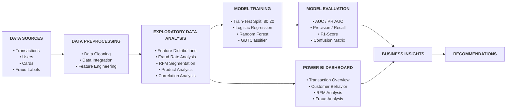

# Banking Transaction Fraud Risk Assessment

**English** | [Tiếng Việt](README.md)

---

## 1. Business Context

Transaction fraud is a material risk for banks because it can cause financial losses, harm customers, increase investigation costs, and create reputational and compliance risks. As transaction volumes and velocity increase, monitoring approaches based only on fixed rules may not adequately identify complex fraud patterns or patterns that change over time.

In this context, the Chief Risk Officer (CRO) assigned the Risk Analyst to complete the project with four objectives:

1. Assess the overall fraud landscape and identify material fraud trends and patterns.
2. Identify high-risk customer groups and analyze fraud across customer segments.
3. Identify products and transaction channels with elevated fraud risk.
4. Evaluate Machine Learning models to support fraud prediction and improve fraud detection.

---

## 2. Key Project Files

| File | Description |
| --- | --- |
| [`banking_transaction_analytics.ipynb`](banking_transaction_analytics.ipynb) | Python/PySpark notebook covering data cleaning, exploratory analysis, statistical testing, feature engineering, and Machine Learning. |
| [`banking_transaction_dashboard.pbix`](banking_transaction_dashboard.pbix) | Power BI report visualizing the fraud landscape, customer behavior, RFM segments, product-level risks, and Machine Learning prediction results. |
| [`requirements.txt`](requirements.txt) | Python libraries required to run the analytical environment. |

---

## 3. Analysis Data

### 3.1. Dataset Scale

| Metric | Scale |
| --- | ---: |
| Initial transactions | 13,305,928 |
| Customer records | 2,000 |
| Card records | 6,146 |
| Labeled transactions used for model analysis | Approximately 8.91 million |
| Fraud rate | Approximately 0.15% |
| Observation period | 2010–2019 |

Fraud represents a very small share of total transactions, making this a highly imbalanced classification problem. Accuracy is therefore not used in isolation to assess model quality; PR-AUC, Precision, Recall, and F1-score are evaluated together.

### 3.2. Main Data Tables and Features

#### 1. `transactions_data.csv` — Transaction data (13.3 million records)

| Column | Description |
| --- | --- |
| `id` | Transaction identifier |
| `date` | Transaction timestamp |
| `client_id` | Customer identifier |
| `card_id` | Card identifier |
| `amount` | Transaction amount (USD) |
| `use_chip` | Transaction method and chip usage |
| `merchant_id` | Merchant identifier |
| `merchant_city` | Merchant city |
| `merchant_state` | Merchant state |
| `zip` | Merchant ZIP code |
| `mcc` | Merchant Category Code |
| `errors` | Transaction error information |

#### 2. `users_data.csv` — Customer data (2,000 customers)

| Column | Description |
| --- | --- |
| `client_id` | Customer identifier |
| `current_age` | Current customer age |
| `retirement_age` | Expected retirement age |
| `birth_year` | Birth year |
| `gender` | Gender |
| `latitude`, `longitude` | Customer location |
| `per_capita_income` | Per-capita income |
| `yearly_income` | Annual income |
| `total_debt` | Total debt |
| `credit_score` | Credit score |
| `num_credit_cards` | Number of credit cards owned |

#### 3. `cards_data.csv` — Card data (6,146 cards)

| Column | Description |
| --- | --- |
| `id` | Card identifier |
| `client_id` | Customer identifier |
| `card_brand` | Card brand (Visa, Mastercard, etc.) |
| `card_type` | Card type (Credit, Debit) |
| `has_chip` | Whether the card has chip technology |
| `credit_limit` | Credit limit |
| `acct_open_date` | Account opening date |
| `year_pin_last_changed` | Most recent PIN change year |
| `card_on_dark_web` | Whether card information was found on the dark web |

#### 4. `train_fraud_labels.csv` — Fraud labels

| Column | Description |
| --- | --- |
| `id` | Transaction identifier |
| `is_Fraud` | Fraud label (True/False, approximately 0.15% positive) |

### 3.3. Data Source

- **Public source:** [Kaggle – Financial Transactions Dataset](https://www.kaggle.com/datasets/computingvictor/transactions-fraud-datasets)
- **Processing platform:** Databricks and Apache Spark.
- **Intended use:** Analysis, methodology demonstration, and experimental model development.

---

## 4. Project Workflow

### 4.1. Data Preparation and Processing

- Review data structures, data types, missing values, and duplicate records.
- Standardize transaction amounts and currency-formatted fields.
- Address missing location and transaction error information using the project rules.
- Join transaction data with customer records, card records, and fraud labels.
- Engineer time, age group, income group, transaction amount, and product-related features.

### 4.2. Current-State Analysis

The analysis focuses on three layers of information:

1. **Activity scale:** transaction volumes and values by time, customer, product, and channel.
2. **Risk level:** fraud counts and fraud rates within each segment.
3. **Management relevance:** areas that require prioritized monitoring, stronger authentication, or further investigation.

### 4.3. RFM Customer Segmentation

Customers are evaluated using three dimensions:

- **Recency:** how recently the customer completed a transaction.
- **Frequency:** how frequently the customer transacts.
- **Monetary:** the total transaction value generated by the customer.

RFM scores are used to assign customers to segments such as Champions, Loyal, New Customers, Potential Loyalists, Need Attention, Cannot Lose Them, and Lost Customers. In this project, RFM serves as a behavioral segmentation layer for risk analysis; it does not replace a bank's formal customer risk-rating framework.

### 4.4. Model Development and Evaluation

Three models were selected to represent different levels of complexity:

- **Logistic Regression:** an interpretable baseline model.
- **Random Forest:** a tree-based ensemble capable of modeling nonlinear relationships.
- **GBTClassifier:** a boosting model that sequentially optimizes decision trees to improve classification performance.

The models are compared across multiple metrics to assess discriminatory power, fraud detection capability, and the cost of false alerts.

---

## 5. Power BI Current-State Analysis

The Power BI analysis is organized around three primary dashboard pages covering the overall fraud landscape, customer risk, and product or transaction-channel risk.

### 5.1. Overview Dashboard — Fraud Landscape and Key Risk Areas

The Overview dashboard covers **13.31 million transactions**, **13,332 fraudulent transactions**, an overall fraud rate of **0.150%**, and approximately **USD 1.75 million** in fraudulent transaction value between 2010 and 2019.

Key findings:

- Transaction volume increased during the earlier years and remained relatively stable thereafter, while the fraud rate was more volatile and reached its highest level in **2016**.
- Fraud rates increased materially for high-value transactions, particularly those above **USD 2,000**.
- Customers with annual income of approximately **USD 100–1,000** showed higher fraud risk than the other income groups in the observed data.
- Fraud was more concentrated between **9:00 AM and 4:00 PM**, particularly on Sundays.
- Most detected fraud cases were located in **North America**.

**Recommendation:** the bank should prioritize monitoring of high-value transactions and time periods with elevated fraud concentration. These signals should be combined with customer, product, and channel information rather than used as standalone decline criteria.

### 5.2. Customer Behavior Dashboard — Customer Groups Requiring Closer Monitoring

The Customer Behavior dashboard analyzes **1,219 active customers out of 2,000 total customers** and compares transaction activity and fraud rates across RFM segments, age groups, time periods, and transaction amounts.

Key findings:

- Potential customers account for **42.49%** of active customers, followed by VIP customers at **32.81%**, at-risk customers at **16.65%**, and other segments at **8.04%**.
- **New Customers** have the highest fraud rate among RFM segments at approximately **0.31%**, while Champions and Cannot Lose Them have the lowest rate at approximately **0.10%**.
- Customers aged **56 and above** have a fraud rate of approximately **0.17%**, higher than several younger age groups.
- Customer transaction activity is concentrated between **6:00 AM and 4:00 PM** and falls to a low level overnight.
- New Customers, Loyal, Lost Customers, and Promising segments show elevated fraud rates for transactions above **USD 2,000**.

**Recommendation:** new customers should receive enhanced monitoring during the early stage of the customer relationship. Age, income, and RFM segment should be treated as supporting signals within a multifactor risk assessment rather than standalone decision criteria.

### 5.3. Product Analysis Dashboard — Higher-Risk Products and Transaction Channels

The Product Analysis dashboard evaluates **4,071 active cards out of 6,146 total cards** and analyzes risk by card type, card brand, transaction method, and number of cards owned.

Key findings:

- Debit cards represent the largest share of the portfolio, followed by Credit and Debit (Prepaid) cards.
- Debit (Prepaid) has the highest fraud rate among card types at approximately **0.22%**.
- Mastercard is the most widely used card brand, followed by Visa, Amex, and Discover.
- Discover has the highest fraud rate among card brands at approximately **0.21%**.
- Online transactions have a fraud rate of **0.84%**, higher than Chip (**0.10%**) and Swipe (**0.03%**), despite having the lowest transaction volume of the three methods.
- Customers who own three cards have a fraud rate of approximately **0.19%**, higher than customers who own one or two cards.

**Recommendation:** Online transactions, prepaid cards, and selected card brands with higher fraud risk should be prioritized when designing rules and step-up authentication. Controls should consider both fraud rate and transaction volume within each group.

---

## 6. Fraud Prediction Model Results

Data processing, feature engineering, model training, and model evaluation are performed in [`banking_transaction_analytics.ipynb`](banking_transaction_analytics.ipynb) using Python and PySpark ML. The Fraud Prediction Result page in Power BI translates the notebook outputs into a management view focused on detected fraud, missed fraud, and the trade-off between Recall and Precision.

*The Fraud Prediction Result dashboard presents results for Logistic Regression, Random Forest, and GBTClassifier calculated in the Python notebook. Because fraud represents only approximately 0.15% of the data, Recall and PR-AUC are more meaningful evaluation metrics than Accuracy.*

### 6.1. Performance Comparison

| Model | ROC-AUC | PR-AUC | Accuracy | Precision | Recall | F1-score |
| --- | ---: | ---: | ---: | ---: | ---: | ---: |
| Logistic Regression | 0.8444 | 0.0213 | 99.85% | 28.97% | 0.29% | 0.58% |
| Random Forest | 0.8934 | 0.0927 | 99.85% | **98.91%** | 2.56% | 5.00% |
| **GBTClassifier** | **0.9427** | **0.2748** | **99.87%** | 94.54% | **11.42%** | **20.38%** |

### 6.2. Fraud Detection Results

| Model | Fraud detected (TP) | Fraud missed (FN) | False alerts (FP) | Total fraud in evaluation set |
| --- | ---: | ---: | ---: | ---: |
| Logistic Regression | 31 | 10,581 | 76 | 10,612 |
| Random Forest | 272 | 10,340 | **3** | 10,612 |
| **GBTClassifier** | **1,212** | **9,400** | 70 | 10,612 |

### 6.3. Selected Model

**GBTClassifier is selected as the best-performing candidate model within the project scope** because it:

- Achieves the highest ROC-AUC and PR-AUC among the three models.
- Detects the largest number of fraudulent transactions at the default threshold.
- Maintains high Precision, limiting the number of false alerts.
- Captures nonlinear relationships and complex interactions among the input features.

The results show that GBT has strong risk-ranking capability. However, Recall of **11.42%** means that the model still misses a large share of fraudulent transactions at the current classification threshold. At this stage, the model is therefore most appropriate as an **alert-ranking and prioritization tool**, rather than an automated decision engine.

### 6.4. Comparison of Model Applications

| Model | Strengths | Main limitation | Appropriate role |
| --- | --- | --- | --- |
| Logistic Regression | Interpretable and computationally efficient | Very low Recall | Baseline and benchmark model |
| Random Forest | Highest Precision and very few false alerts | Misses most fraud cases | Use case prioritizing alert accuracy |
| GBTClassifier | Best discrimination and Recall | Recall remains low at the default threshold | Candidate model for further optimization and testing |

---

## 7. Recommendations

### 7.1. Prioritize Risk-Based Transaction Monitoring

- Apply enhanced monitoring to Online and high-value transactions.
- Combine transaction amount, payment method, time, customer profile, and historical behavior within transaction rules or a risk score.
- Establish tiered control thresholds for approval, step-up authentication, investigation, or temporary review holds.

### 7.2. Strengthen Monitoring of New Customers and Accounts

- Apply KYC and identity verification measures that are proportionate to risk.
- Monitor behavior during the initial period after account or card activation.
- Compare observed transactions with the customer's profile and expected behavior.
- Use RFM segmentation as a supporting signal rather than the sole basis for fraud-risk classification.

### 7.3. Optimize the Model for Investigation Capacity

- Optimize the classification threshold using the Precision–Recall Curve and the bank's risk appetite.
- Evaluate Recall at a fixed false-positive rate or at the maximum alert volume the investigation team can process.
- Apply cost-sensitive learning to reflect the different costs of missed fraud and false alerts.
- Add behavioral features such as transaction velocity, deviation from normal behavior, and sequential transaction patterns.
- Apply SHAP or an equivalent explainability method before model outputs are used in decision-making processes.

### 7.4. Establish Model Governance

Before production implementation, the following controls should be completed:

- Independent validation and approval under the Model Risk Management framework.
- Back-testing on out-of-sample and more recent data.
- Monitoring of data drift, concept drift, Recall, Precision, alert rate, and fraud losses.
- Clear model ownership, review frequency, and retraining triggers.
- Human-in-the-loop controls for decisions that directly affect customers.

---

## 8. Limitations

The project results should be interpreted within the boundaries of the available dataset. Key limitations include:

1. **Public and synthetic data:** the dataset is suitable for analysis and methodology testing but does not fully represent the customers, products, controls, and operating processes of a specific bank.
2. **Historical observation period:** the data ends in 2019 and therefore does not fully reflect newer fraud typologies, payment technology, and customer behavior.
3. **Severe class imbalance:** fraud represents only approximately 0.15% of transactions, which can make metrics such as Accuracy appear more favorable than the model's true fraud-detection capability.
4. **Incomplete label coverage:** the labeled dataset used for modeling is smaller than the full transaction dataset, so portfolio EDA and model results may use different denominators.
5. **Missing behavioral and authentication variables:** the data does not include complete device fingerprints, IP addresses, authentication results, chargeback lifecycles, alert histories, or investigation outcomes.
6. **Small sample sizes in selected segments:** high fraud rates in certain amount or income groups may be volatile and require additional testing before they are converted into policy.
7. **Incomplete geographic and transaction error data:** some location and error fields are missing and require treatment during data preparation.
8. **RFM covers active customers only:** the segmentation results do not represent the full customer file when some customers have no activity during the observation period.
9. **Data protection requirements:** card data must be masked or tokenized in a production environment, and sensitive fields should not be included in reports, logs, or model workflows without a valid need and appropriate access rights.

These limitations do not invalidate the analytical findings, but they define the conditions under which the results should be used responsibly and in line with sound risk-management practices.

---

## 9. 🛠️ Technology Stack

**Platforms & Computing**

- **Databricks** (Serverless Spark)
- **Apache Spark 3.x** (distributed data processing)

**Languages & Libraries**

- **Python 3.x** (pandas, NumPy, scikit-learn)
- **PySpark ML** (Pipeline, VectorAssembler, StandardScaler, StringIndexer, OneHotEncoder)
- **ML Algorithms:** Logistic Regression, Random Forest, GBTClassifier
- **Evaluation:** BinaryClassificationEvaluator, confusion matrix, Precision, Recall, F1-Score
- **Visualization:** Matplotlib, Seaborn

**Data Source & Storage**

- **Kaggle:** [Financial Transactions Dataset](https://www.kaggle.com/datasets/computingvictor/transactions-fraud-datasets)
- **Google BigQuery:** Storage and access for the imported Kaggle dataset.

**Visualization & Reporting**

- **Microsoft Power BI:** Interactive dashboards for the fraud landscape, customer behavior, product analysis, and model results.
- **DAX:** Measures and analytical metrics used in Power BI.
- **Markdown:** Project documentation and analytical reporting in the README files.
