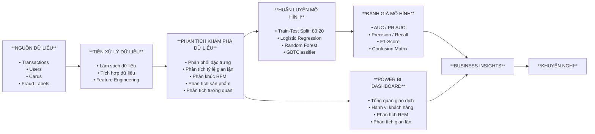

# 🏦 Phát hiện gian lận trong giao dịch ngân hàng

**Notebook:** `banking_transaction_analytics.ipynb`     
**Dashboard:** `banking_transaction_dashboard.pbix`     
**Tác giả:** Nguyễn Thị Ngọc Minh       
**Loại dự án:** Power BI + PySpark ML   

---

## 📊 Tổng quan dự án

Phát hiện gian lận là một trong những thách thức quan trọng trong lĩnh vực tài chính, khi các hệ thống dựa trên luật truyền thống gặp khó khăn trong việc phát hiện các mẫu gian lận phức tạp trên khối lượng giao dịch lớn.

Dự án sử dụng **machine learning có giám sát (supervised machine learning)** để xây dựng và đánh giá các mô hình phát hiện gian lận bằng PySpark ML trên tập dữ liệu ngân hàng quy mô lớn có gắn nhãn gian lận.

**Nguồn dữ liệu:** [Kaggle - Financial Transactions Dataset](https://www.kaggle.com/datasets/computingvictor/transactions-fraud-datasets)

### 🎯 Mục tiêu

Dự án tập trung phân tích dữ liệu giao dịch nhằm:

* Xác định giao dịch bất thường và hành vi tài chính đáng ngờ.
* Tìm hiểu hành vi giao dịch, chi tiêu và phân khúc khách hàng.
* Phân tích các sản phẩm và dịch vụ được sử dụng phổ biến.
* Phát hiện các giao dịch bất thường và rủi ro gian lận bằng các mô hình machine learning.
* Đưa ra các insight có tính ứng dụng cho hoạt động ngân hàng và quản trị rủi ro.

## 📂 Thông tin dữ liệu

* **Tổng số giao dịch:** 13,305,928
* **Khách hàng:** 2,000 khách hàng
* **Thẻ:** 6,146 thẻ
* **Tỷ lệ gian lận:** ~0.15% (dữ liệu mất cân bằng nghiêm trọng)
* **Thời gian:** 2010 - 2019

### 🔑 Các bảng dữ liệu & đặc trưng chính

#### **1. Dữ liệu giao dịch** (13.3M bản ghi)

| Cột            | Mô tả                                             |
| -------------- | ------------------------------------------------- |
| id             | Mã giao dịch                            |
| date           | Thời gian giao dịch                               |
| client_id      | Mã khách hàng                                     |
| card_id        | Mã thẻ                                            |
| amount         | Giá trị giao dịch (USD)                           |
| use_chip       | Giao dịch có sử dụng xác thực bằng chip hay không |
| merchant_id    | Mã đơn vị bán hàng                                |
| merchant_city  | Địa điểm của đơn vị bán hàng (thành phố)          |
| merchant_state | Địa điểm của đơn vị bán hàng (bang)               |
| zip            | Mã ZIP của đơn vị bán hàng                        |
| mcc            | Merchant Category Code (loại hình kinh doanh)     |
| errors         | Thông tin lỗi giao dịch                           |

#### **2. Dữ liệu khách hàng** (2,000 khách hàng)

| Cột                 | Mô tả                        |
| ------------------- | ---------------------------- |
| client_id           | Mã khách hàng                |
| current_age         | Tuổi khách hàng              |
| retirement_age      | Độ tuổi nghỉ hưu dự kiến     |
| birth_year          | Năm sinh                     |
| gender              | Giới tính                    |
| latitude, longitude | Vị trí khách hàng            |
| per_capita_income   | Thu nhập bình quân đầu người |
| yearly_income       | Thu nhập hàng năm            |
| total_debt          | Tổng dư nợ                   |
| credit_score        | Điểm tín dụng                |
| num_credit_cards    | Số lượng thẻ tín dụng sở hữu |

#### **3. Dữ liệu thẻ** (6,146 thẻ)

| Cột                   | Mô tả                                                |
| --------------------- | ---------------------------------------------------- |
| id                    | Mã thẻ                                               |
| client_id             | Mã khách hàng                                 |
| card_brand            | Thương hiệu thẻ (Visa, Mastercard,...)               |
| card_type             | Loại thẻ (Credit, Debit)                             |
| has_chip              | Thẻ có công nghệ chip hay không                      |
| credit_limit          | Hạn mức tín dụng                                     |
| acct_open_date        | Ngày mở tài khoản                                    |
| year_pin_last_changed | Năm thay đổi PIN gần nhất                            |
| card_on_dark_web      | Thông tin thẻ có bị phát tán trên dark web hay không |

#### **4. Nhãn gian lận** (biến mục tiêu)

| Cột      | Mô tả                                       |
| -------- | ------------------------------------------- |
| id       | Mã giao dịch                                |
| is_Fraud | Nhãn gian lận (True/False, ~0.15% positive) |

---

## 🗺️ Quy trình thực hiện dự án



---

## 📈 So sánh hiệu suất mô hình

### 🏆 Kết quả tổng quan

| Mô hình                 | AUC        | PR AUC     | Accuracy   | Precision  | Recall     | F1-Score   |
| ----------------------- | ---------- | ---------- | ---------- | ---------- | ---------- | ---------- |
| **Logistic Regression** | 0.8444     | 0.0213     | 99.85%     | 28.97%     | 0.29%      | 0.58%      |
| **Random Forest**       | 0.8934     | 0.0927     | 99.85%     | **98.91%** | 2.56%      | 5.00%      |
| **GBTClassifier**       | **0.9427** | **0.2748** | **99.87%** | 94.54%     | **11.42%** | **20.38%** |

### 🔍 Hiệu quả phát hiện gian lận

| Mô hình                 | Gian lận phát hiện (TP) | Gian lận bỏ sót (FN) | Cảnh báo sai (FP) | Tổng gian lận |
| ----------------------- | ----------------------- | -------------------- | ----------------- | ------------- |
| **Logistic Regression** | 31                      | 10,581               | 76                | 10,612        |
| **Random Forest**       | 272                     | 10,340               | **3**             | 10,612        |
| **GBTClassifier**       | **1,212**               | **9,400**            | 70                | 10,612        |

---

## 💡 Các insight chính

### ✅ Điểm mạnh của mô hình

**GBTClassifier (Mô hình được đề xuất)**

* **Khả năng phân biệt cao nhất:** AUC 0.9427 cho thấy khả năng xếp hạng giao dịch gian lận và hợp lệ rất tốt.
* **Khả năng phát hiện gian lận tốt nhất:** Phát hiện **1,212 trên 10,612 trường hợp gian lận** (Recall 11.42%).
* **PR AUC cao nhất (0.2748):** Gần **3 lần** Random Forest và **13 lần** Logistic Regression trên tập dữ liệu mất cân bằng.
* **Precision cao (94.54%):** Tỷ lệ dự báo gian lận chính xác. Nghĩa là trong 100 cảnh báo gian lận, có khoảng 94 trong số đó là thực sự gian lận.
* **Tỷ lệ false positive rất thấp (0.00098%):** Chỉ có 70 cảnh báo sai trên 7.1M giao dịch hợp lệ.
* **Phát hiện các mẫu phức tạp:** Quá trình xây dựng cây tuần tự giúp mô hình học được các hành vi gian lận phi tuyến tính.

**Random Forest**

* **Precision cao nhất (98.91%):** Khả năng chính xác rất cao khi đánh dấu giao dịch gian lận.
* **False positive thấp nhất (3):** Giảm thiểu sự ảnh hưởng đến khách hàng.
* **Hiệu suất ổn định:** Phương pháp ensemble giúp giảm nguy cơ overfitting.

**Logistic Regression**

* **Nhanh và dễ diễn giải:** Cung cấp hệ số của các đặc trưng để hỗ trợ giải thích cho doanh nghiệp.
* **Baseline tốt:** AUC 0.8444 cho thấy khả năng xếp hạng giao dịch ở mức khá.
* **Minh bạch:** Tính dễ giải thích hỗ trợ các yêu cầu về explainability.

### ⚠️ Hạn chế quan trọng

* **Tất cả các mô hình đều có Recall thấp** khi sử dụng threshold mặc định do dữ liệu mất cân bằng nghiêm trọng (~0.15% fraud).
* **Logistic Regression phát hiện gian lận chưa hiệu quả:** Recall chỉ 0.29%, không phù hợp để triển khai thực tế.
* **Ngay cả mô hình tốt nhất (GBT) vẫn bỏ sót ~88% gian lận** nếu không tối ưu threshold.
* **Accuracy có thể gây hiểu nhầm:** Accuracy 99.85% chủ yếu phản ánh sự mất cân bằng giữa hai lớp dữ liệu.

### 🎯 Phân tích đánh đổi

```text
                         Khả năng phát hiện    Cảnh báo sai    Chất lượng tổng thể
Logistic Regression:          ★☆☆☆☆             ★★☆☆☆          ★★☆☆☆ (Baseline yếu)
Random Forest:                ★★☆☆☆             ★★★★★          ★★★☆☆ (Precision cao nhất)
GBTClassifier:                ★★★★☆             ★★★★☆          ★★★★★ (Tốt nhất tổng thể)
```

---

## 📊 Power BI Dashboard

Dashboard Power BI cung cấp góc nhìn tương tác về hoạt động giao dịch, hành vi khách hàng, phân khúc RFM và các mẫu gian lận trên bộ dữ liệu giao dịch ngân hàng tại Mỹ giai đoạn 2010–2019.

---

### **Dashboard 1 — Tổng quan**


#### **Giao dịch & Thị trường**

* Hoạt động giao dịch tăng đều từ **2010 đến 2016**, sau đó tương đối ổn định đến năm 2019.
* Hoạt động giao dịch có **tính mùa vụ**, với mức giảm đáng chú ý vào tháng 2 và các giai đoạn tăng giảm xen kẽ trong các tháng còn lại.
* Giao dịch tập trung chủ yếu tại **khu vực phía Đông và các khu vực ven biển của Mỹ**.

#### **Sản phẩm & Thanh toán**

* **Thẻ ghi nợ (Debit cards)** chiếm tỷ trọng lớn nhất về cả số lượng và giá trị giao dịch, tiếp theo là credit và prepaid cards.
* **Mastercard** có số lượng giao dịch cao nhất, tiếp theo là Visa, Amex và Discover.
* Khoảng **11.97M/13.31M giao dịch (~90%)** được thực hiện bằng thẻ có chip.
* Từ năm 2015, **giao dịch bằng chip trở thành phương thức thanh toán chủ đạo**, thay thế giao dịch quẹt thẻ.

#### **Mẫu gian lận theo phương thức thanh toán**

* **Giao dịch online chiếm khoảng 86.73% số trường hợp gian lận**, tiếp theo là chip với 10.23% và swipe.
* Giao dịch bằng chip trở thành phương thức thanh toán chủ đạo sau năm 2015 và ban đầu có mức độ rủi ro gian lận tương đối thấp.
* Tuy nhiên, mẫu gian lận trong các giao dịch chip thay đổi theo thời gian, cho thấy cần **liên tục theo dõi thay vì mặc định một phương thức thanh toán luôn có rủi ro thấp**.

#### **Key Takeaway**

* Bộ dữ liệu chủ yếu phản ánh nhóm **khách hàng cá nhân** với mục đích giao dịch tiêu dùng hằng ngày, trong đó debit cards và các giao dịch giá trị nhỏ chiếm phần lớn hoạt động. 
* **Thanh toán bằng chip ngày càng phổ biến sau năm 2015**, phản ánh sự chuyển dịch sang các phương thức thanh toán hiện đại. 
* **Giao dịch online chiếm phần lớn số trường hợp gian lận (86.73%)**, khiến thanh toán online trở thành một khu vực cần được ưu tiên giám sát. 
* Các mẫu gian lận thay đổi theo từng phương thức thanh toán cũng cho thấy tầm quan trọng của việc **liên tục theo dõi rủi ro bảo mật thanh toán theo thời gian**.

---

### **Dashboard 2 — Hành vi khách hàng**


* **Giao dịch tiền vào chiếm khoảng 95% tổng giá trị giao dịch**, cho thấy hoạt động chủ yếu là nhận tiền vào tài khoản hoặc thực hiện các giao dịch trong phạm vi hệ thống, trong khi giao dịch chuyển tiền ra ngoài chiếm tỷ trọng thấp.
* Khách hàng từ **46 tuổi trở lên chiếm gần một nửa hoạt động giao dịch**, trong khi nhóm 26–35 tuổi có tỷ trọng thấp nhất trong các nhóm tuổi có dữ liệu.
* Không có dữ liệu giao dịch của khách hàng dưới 26 tuổi trong tập dữ liệu.
* Các giao dịch hoạt động tập trung trong khoảng thời gian từ **06:00–16:00**, giảm dần vào buổi tối và tương đối thấp trong khoảng 00:00–05:00.

#### **Key Takeaway**

Tệp khách hàng chủ yếu là **nhóm trung niên và lớn tuổi**, với hoạt động giao dịch tập trung vào ban ngày, đồng thời dòng tiền vào chiếm tỷ trọng áp đảo, cho thấy dữ liệu phản ánh hoạt động nhận tiền vào tài khoản là chủ yếu.

---

### **Dashboard 3 — Phân tích RFM**


Phân tích RFM đánh giá khách hàng trên ba khía cạnh:

* **Recency:** Khách hàng thực hiện giao dịch gần đây đến mức nào.
* **Frequency:** Khách hàng thực hiện giao dịch thường xuyên như thế nào.
* **Monetary:** Tổng giá trị giao dịch mà khách hàng tạo ra.

Mỗi tiêu chí được chấm điểm từ **1 đến 5**, trong đó 5 thể hiện mức độ tương tác hoặc giá trị cao hơn.

Khách hàng được chia thành ba nhóm chính:

* **Khách hàng VIP:** Champions, Loyal
* **Khách hàng mới:** New Customers, Potential Loyalists, Promising
* **Khách hàng có rủi ro:** Need Attention, Cannot Lose Them, Lost Customers

Dashboard trực quan hóa **phân bố khách hàng và hoạt động giao dịch theo từng phân khúc**, giúp xác định nhóm khách hàng có giá trị cao, khách hàng mới và khách hàng có nguy cơ rời bỏ.

Dashboard cũng cung cấp **điểm RFM ở cấp độ khách hàng**, hỗ trợ phân tích sâu hơn về hành vi và giá trị của từng khách hàng.

#### **Key Takeaway**

Phân khúc RFM cung cấp góc nhìn dựa trên hành vi khách hàng, giúp xác định **khách hàng có giá trị cao, khách hàng mới và khách hàng có nguy cơ rời bỏ**. Những insight này có thể hỗ trợ chiến lược giữ chân, tái tương tác và ưu tiên nhóm khách hàng có giá trị cao.

---

### **Dashboard 4 — Phân tích gian lận**


* Tỷ lệ gian lận tăng theo **giá trị giao dịch**, đặc biệt với các giao dịch trên **$500**, dù nhóm này có số lượng giao dịch tương đối thấp.
* Khách hàng có thu nhập hàng năm **$100–$1,000** có tỷ lệ gian lận cao nhất giữa các nhóm thu nhập, đồng thời có số lượng giao dịch tương đối ít.
* **New Customers** có tỷ lệ gian lận cao nhất trong các nhóm RFM, khoảng **0.31%**, trong khi Champions có tỷ lệ thấp hơn, khoảng **0.10%**.
* Khách hàng **56+** có tỷ lệ gian lận khoảng **0.17%** và chiếm gần một nửa hoạt động giao dịch.
* Gian lận tập trung trong khoảng **06:00–16:00** và tương đối cao vào **Chủ nhật**.
* Các giao dịch trên khoảng **$1,000** là khu vực có rủi ro cao cần được tăng cường giám sát.

#### **Key Takeaway**

Rủi ro gian lận có liên quan đến **giá trị giao dịch, phân khúc khách hàng, phương thức thanh toán và thời điểm giao dịch**. Do đó, các giao dịch giá trị cao, giao dịch online, khách hàng mới và một số khoảng thời gian nhất định nên được ưu tiên trong hoạt động giám sát và phòng chống gian lận.

---

## 🚀 Khuyến nghị kinh doanh

### **1. Tăng cường giám sát giao dịch theo mức độ rủi ro**

* **Áp dụng xác thực chặt chẽ hơn đối với giao dịch giá trị cao**, đặc biệt với các giao dịch có giá trị trên **$500–$1,000**.
* **Tăng cường giám sát giao dịch online**, chiếm **86.73% số trường hợp gian lận được xác định**, bằng cách tăng cường xác thực giao dịch chặt chẽ hơn và thêm đánh giá rủi ro theo cấp độ đối với giao dịch online.
* **Tăng cường giám sát trong các khoảng thời gian có rủi ro cao**, đặc biệt **06:00–16:00 và cuối tuần, nhất là Chủ nhật**.
* Xây dựng **các quy tắc giao dịch dựa trên rủi ro**, kết hợp các chỉ tiêu như giá trị giao dịch, phương thức thanh toán, thời gian, hồ sơ khách hàng và hành vi trong quá khứ thay vì chỉ dựa vào một chỉ báo gian lận.

### **2. Tăng cường giám sát khách hàng & tài khoản mới**

* **Tăng cường KYC và xác minh danh tính đối với khách hàng mới**, bao gồm thông tin cá nhân và xác thực sinh trắc học khi phù hợp, đảm bảo tài khoản mới được tạo không phải là tài khoản ảo được tạo với mục đích gian lận.
* **Theo dõi các tài khoản mới sau khi kích hoạt** để phát hiện các mẫu giao dịch bất thường hoặc hoạt động không phù hợp với hành vi dự kiến của khách hàng.
* Chú ý hơn đến **khách hàng có thu nhập thấp ($100–$1,000/năm)** khi giá trị hoặc hành vi giao dịch không phù hợp với lịch sử chi tiêu hoặc thu nhập của khách hàng.
* Kết hợp **phân khúc RFM vào hoạt động giám sát gian lận** để xác định nhóm khách hàng cần xem xét thêm, đồng thời tránh áp dụng các biện pháp kiểm soát không cần thiết với nhóm có rủi ro gian lận thấp.

### **3. Cải thiện mô hình phát hiện gian lận**

* **Tối ưu classification threshold** bằng Precision-Recall Curve thay vì chỉ sử dụng threshold mặc định 0.5.
* Áp dụng **cost-sensitive learning** để tăng mức độ ưu tiên đối với các trường hợp gian lận bị bỏ sót.
* Thử nghiệm các phương pháp **xử lý mất cân bằng dữ liệu**, chẳng hạn như SMOTE, ADASYN hoặc các phương pháp resampling khác.
* Bổ sung các đặc trưng hành vi như **transaction velocity, spending deviation và sequential transaction patterns**.
* Thực hiện **hyperparameter optimization và cross-validation** để cải thiện khả năng tổng quát hóa của mô hình.
* Sử dụng **SHAP hoặc các kỹ thuật explainability khác** để xác định các yếu tố đóng góp vào dự đoán gian lận.

### **4. Tác động kỳ vọng**

* **Giảm rủi ro gian lận** bằng cách tập trung nguồn lực giám sát vào các giao dịch, kênh, thời điểm và nhóm khách hàng có rủi ro cao.
* **Cải thiện khả năng phát hiện sớm hoạt động đáng ngờ**, đặc biệt đối với giao dịch online, giao dịch giá trị cao và tài khoản mới.
* **Ưu tiên xử lý các trường hợp gian lận** dựa trên hành vi khách hàng và risk score từ mô hình.
* **Giảm sự bất tiện không cần thiết cho khách hàng** bằng cách chỉ áp dụng xác thực bổ sung đối với các hoạt động có rủi ro cao hơn.
* Xây dựng nền tảng tốt hơn cho việc **giám sát gian lận liên tục và cải thiện mô hình dự báo trong tương lai**.

---

## 🛠️ Công nghệ sử dụng

**Nền tảng & Tính toán**

* **Databricks** (Serverless Spark)
* **Apache Spark 3.x** (xử lý dữ liệu phân tán)

**Ngôn ngữ & Thư viện**

* **Python 3.x** (pandas, NumPy, scikit-learn)
* **PySpark ML** (Pipeline, VectorAssembler, StandardScaler, StringIndexer, OneHotEncoder)
* **ML Algorithms:** Logistic Regression, Random Forest, GBTClassifier
* **Evaluation:** BinaryClassificationEvaluator, confusion matrix, Precision, Recall, F1-Score
* **Visualization:** Matplotlib, Seaborn

**Nguồn dữ liệu & Lưu trữ**

* **Kaggle:** [Financial Transactions Dataset](https://www.kaggle.com/datasets/computingvictor/transactions-fraud-datasets)
* **Google BigQuery:** Lưu trữ và truy cập dataset Kaggle đã được import.

---

## 📂 Cấu trúc dự án

```text
Banking-Transaction-Analysis/
│
├── README.md
├── banking_transaction_analytics.ipynb
├── banking_transaction_dashboard.pbix
│
└── Data Tables
    ├── transactions_data          # 13.3M bản ghi giao dịch
    ├── users_data                 # 2K hồ sơ khách hàng
    ├── cards_data                 # 6.1K bản ghi thẻ
    └── train_fraud_labels         # Nhãn gian lận
```

---

## 🔮 Hướng phát triển

### **1. Mô hình nâng cao**

* Thử nghiệm **advanced ML, deep learning và ensemble models** để phát hiện các mẫu gian lận phức tạp hơn.
* So sánh các phương pháp với **các nghiên cứu hiện có về phát hiện gian lận**.

### **2. Mở rộng đặc trưng**

* Bổ sung **transaction velocity, spending deviation, sequential behavior, merchant, location và temporal features**.
* Xác định thêm các biến có khả năng dự báo bằng cách tham khảo **các nghiên cứu về phát hiện gian lận**.

### **3. Xử lý dữ liệu & mất cân bằng**

* Đánh giá các phương pháp **scaling và transformation** khác cho các biến có phân phối lệch mạnh.
* Thử nghiệm **cost-sensitive learning, SMOTE, ADASYN và các phương pháp xử lý mất cân bằng khác**.

### **4. Giám sát gian lận theo thời gian thực**

* Phát triển hệ thống **real-time transaction monitoring** với khả năng chấm điểm rủi ro liên tục.
* Tạo **cảnh báo tự động** cho các giao dịch có rủi ro cao và hỗ trợ theo dõi hành vi khách hàng liên tục.

### **5. Explainable AI & Nghiên cứu mở rộng**

* Áp dụng **SHAP** để xác định các yếu tố có ảnh hưởng lớn nhất đến dự đoán gian lận.
* Sử dụng các kết quả này để phát triển **các đặc trưng hành vi mới** và mở rộng hướng nghiên cứu về rủi ro gian lận.

---

## 👤 Tác giả

**Nguyễn Thị Ngọc Minh**
**GitHub:** https://github.com/ngocminh0123
